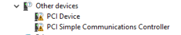

## Download the image .iso and windows versions

Windows Drivers: https://learnlinux.link/virt-win (filename virt-win.iso)
Windows Image Installation Media: https://www.microsoft.com/en-us/software-download/windows10 

Full Instructions
Windows10: https://www.youtube.com/watch?v=eyNlGAzf-L4&list=PLT98CRl2KxKHnlbYhtABg6cF50bYa8Ulo&index=7&t=193s 

## Instructions

Start by downloading the windows drivers and creating a WIN10 .iso image using an imaging software (see links above). Once these are ready, upload them in proxmox on the local storage as ISO images

### OS
In ProxMox, create the OS, select the appropriate storage (local default). Select the Windows ISO image, and update the Type and Version to match Windows being used.

### System
Select the appropriate settings, ensure the SCSI Controller is set to VirtIO SCSI Single (will be assigned to the drivers downloaded)

Enable Qemu Agent (will be set up on the VM later)

### Disks
Based on Proxmox documentation, recommended settings
- Bus --> Set to SCSI
- Assign the disk size (recommended 64GB min)
- Discard --> Enable
- Cache --> Set to write-back

### CPU
- Recommended 2 cores min

### Memory
- Recommended 2048 Gb RAM min

### Network
- Assign to the VLAN as appropriate, or leave as vmbr0 as default if no vlans assigned

## Add Drivers
On the Windows VM, go to hardware tab and select Add --> CD/DVD Drive --> Use CD/DVD disc image file (iso) --> 
- Bus/Device = SCSI, 
- Storage = local
- ISO Image = virt-win.iso (downloaded from above link)

## Start the VM & Install Windows

Start the VM and walk through the installation prompts. If this is going to be a template, select I don't have a product key (can be set later on each VM deployment). If a product key is available, can be used now.

NOTE: If using as a template, stop here and convert to template. Clone to a VM once ready to deploy and proceed:

Select the version of windows to be used. Note, remote desktop only works with WIndows 10 Pro

## Installing the drivers
Select Custom installation, then Browse for the drivers. Select the CD Drive that was previously installed with the virtio-win drivers.

### Install the Hard Drive
Navigate to the (virt-win drive): vioscsi \ (windows version folder) \ amd64

Select next through the prompts until Windows installs. You will also need to define the type of account that will get created (business/personal) and login to the microsoft account associated with the user.

### Install Additional Drivers
Once windows finishes installing, login to the desktop and open Device Manager. You will see missing drivers under "Other Devices"

Right click on the PCI Device, and click update drivers --> Browse to the (virtio-win drive): --> Select Balloon \ (windows OS) \ amd64 

Right Right click on the PCI Simple Communications Controllers > update driver > Browse > (virtio-win drive): > OK

## Install the QEMU Agent:
Open the virtio-win drive in file explorer and run the guest agent located at:

(virtio-win drive): \ guest-agent \ qemu-ga-x86_64.msi

## Enable ping requests
Windows Firewall:

Windows 10 has a built-in firewall that, by default, blocks ICMP (ping) requests. If you'd like to be able to ping the windows VM and allow ICMP requests:

- Open the Windows Firewall settings on the Windows 10 VM.
- Click on "Advanced settings".
- In the left pane, click on "Inbound Rules".
- In the right pane, find the rules titled "File and Printer Sharing (Echo Request - ICMPv4-In)".
- Right-click on these rules and choose "Enable Rule".

## Register Product Key
There will be some notices on the desktop that the windows version installed is invalid and needs to be registered. Once a product key is procured, go to:

File Explorer > Right-Click This PC > Properties > Change product key or upgrade your edition of Windows